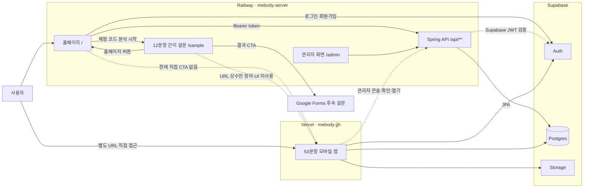

# MEBODY 제품·기술 현황

> 내부 개발·기획 기술팀을 위한 통합 현황 문서
>
> 기준일: 2026-08-27

MEBODY는 사용자가 자기 점검 설문을 통해 현재 몸의 정렬과 움직임 경향을 확인하고, 4축 기반 mebody 코드와 관리 콘텐츠를 살펴볼 수 있는 웰니스 서비스입니다.

MEBODY의 결과는 의료 진단, 통증 판독, 치료, 교정 또는 재활 처방이 아닙니다. 이상 증상이나 지속적인 통증이 있다면 의료 전문가의 판단을 우선해야 합니다.

## 문서 목적과 상태 표기

이 README는 다음 내용을 한곳에서 확인하기 위한 내부 기준 문서입니다.

1. 지금까지 실제로 구현된 사용자 플로우
2. 홈페이지, 12문항 간이 설문, 53문항 모바일 앱, Spring 서버와 Supabase의 연결 구조
3. 결과 페이지 이후 기능과 비즈니스 모델의 현재 상태

기능과 아이디어는 아래 상태로 구분합니다.

| 상태 | 의미 |
|---|---|
| `완료` | 현재 코드와 배포 흐름에 연결되어 있음 |
| `부분 구현` | 화면, 데이터 또는 기반 구조 일부만 존재함 |
| `미구현` | 현재 동작하는 기능이 없음 |
| `추후 확장` | 방향만 열어 두었고 구현을 약속하거나 확정하지 않음 |
| `확인 필요` | 코드·문구·운영 정책 사이의 정리가 필요함 |

## 저장소와 배포 구조

| 구성 | 저장소·배포 | 역할 |
|---|---|---|
| 홈페이지·서버 | [MebodyServer](https://github.com/MebodyCTO/MebodyServer) / [Railway 설정 주소](https://mebody-server-production.up.railway.app/) | 홈페이지, `/sample`, `/admin`, Spring API |
| 12문항 간이 설문 | [sample-questionnaire](https://github.com/MebodyCTO/MebodyServer/tree/main/sample-questionnaire) | 홈페이지에서 연결되는 간이 체크 React 앱 |
| 53문항 모바일 앱 | [mebody-jjh](https://github.com/chldngur89/mebody-jjh) / [Vercel](https://mebody-jjh.vercel.app/) | 정밀 설문, 결과, 코드 플랜, 회원 기능 |
| 인증·데이터 | Supabase | Auth, Postgres, Storage |
| 후속 외부 설문 | [Google Forms](https://docs.google.com/forms/d/e/1FAIpQLSfQyJ5UwkOYICfq-HPGR0f6CqbaDjmmu6nPgWsfz6XFb_0Vsg/viewform) | 현재 12문항 결과 CTA가 연결되는 설문 |

세부 서버 실행 방법과 API는 [서버 README](https://github.com/MebodyCTO/MebodyServer/blob/main/README.md), 간이 설문 빌드 방법은 [간이 설문 README](https://github.com/MebodyCTO/MebodyServer/blob/main/sample-questionnaire/README.md)를 참고합니다.

> 배포 확인: 설정과 기존 문서에 기록된 Railway 주소는 2026-08-27 기준 `/`, `/sample`, `/api/public/config`에서 HTTP 404를 반환합니다. 아래 홈페이지 흐름은 현재 코드 기준이며 Railway 서비스·도메인 연결 상태는 별도로 확인해야 합니다.

## 현재 사용자 플로우

### 홈페이지와 12문항 간이 설문

```text
사용자
→ Railway 홈페이지 `/`
→ “체형 코드 분석 시작” 클릭
→ 같은 오리진 `/sample`
→ 12문항 간이 체크
→ 브라우저에서 간이 코드 계산
→ 간이 결과 페이지
→ Google Forms 후속 설문
```

- 홈페이지의 주요 진단 CTA는 같은 Railway 오리진의 `/sample`로 이동합니다.
- 12문항은 번들된 문항 스냅샷과 로컬 미디어를 기본으로 사용합니다.
- 문항별 최적화 WebP 메인 이미지와 선택 ①·③ 이미지가 연결되어 있습니다.
- 선택 ②는 별도 선택 이미지를 표시하지 않고 메인 미디어를 유지합니다.
- 2번과 3번은 같은 이미지 세트를 공유하며, 10번과 12번은 기존 미디어 동작을 유지합니다.
- 답변은 브라우저에서 4축 간이 코드로 계산됩니다. 확정하기 어려운 축에는 `M(미확정)`이 포함될 수 있습니다.
- 결과 CTA는 현재 Google Forms로 이동합니다.
- 결과 하단의 홈페이지 버튼은 같은 오리진 `/`로 돌아갑니다.
- Supabase 문항 조회·응답 제출은 환경변수로 활성화할 수 있지만, 기본 간이 체크와 결과 표시는 DB 없이 동작합니다.

### 53문항 모바일 앱

```text
Vercel 모바일 앱
→ 랜딩·안내·동의
→ 사전체크 4개 + 본문 49개, 총 53문항
→ 클라이언트에서 4축 및 16개 코드 계산
→ Supabase에 결과 저장 시도
→ 무료 결과 페이지
→ 즉시 액션·코드 플랜·15분 루틴 화면
→ 회원가입·로그인·마이페이지
```

- 첫 문항은 번들된 53문항 스냅샷으로 즉시 표시하고 Supabase `questions`를 백그라운드에서 갱신합니다.
- 53문항 완료 후 클라이언트에서 결과 코드를 즉시 계산합니다.
- Supabase 저장이 실패해도 현재 탭에서는 로컬 결과 화면을 계속 표시합니다.
- 로그인 회원의 최신 코드 정본은 `questionnaire_responses`의 최근 `completed` 결과입니다.
- `user_profiles.body_bti_code`는 빠른 표시용 캐시이며 제출 성공 시 갱신합니다.
- 비회원 결과 ID는 현재 탭의 `sessionStorage`에만 유지됩니다.
- 현재 동의 화면 일부에 `32문항` 표현이 남아 있으며 53문항 기준으로 정리가 필요합니다.

## 홈페이지·앱·서버 연결 아키텍처



정상적인 53문항 진단, 문항 로딩, 결과 계산과 결과 표시는 모바일 앱과 Supabase가 담당합니다. Spring 서버가 중단되어도 고객 진단 흐름이 막히지 않는 구조가 기본 원칙입니다.

### 연결 상태

| 연결 | 상태 | 현재 동작 |
|---|---|---|
| 홈페이지 → 12문항 간이 설문 | `완료` | 홈페이지 CTA가 같은 오리진 `/sample`로 이동 |
| 간이 결과 → Google Forms | `완료` | 결과 안내 카드가 외부 설문을 새 탭으로 열음 |
| 간이 결과 → 홈페이지 | `완료` | 결과 하단 버튼이 `/`로 이동 |
| 홈페이지 → Vercel 모바일 앱 | `미구현` | 앱 URL 설정은 있지만 사용자용 직접 CTA 없음 |
| 간이 결과 → Vercel 회원가입·정밀 체크 | `미구현` | `APP_SIGNUP_URL` 상수만 존재하고 현재 UI에서는 사용하지 않음 |
| 모바일 앱 → Supabase | `완료` | Auth, 문항·결과·콘텐츠 DB, Storage 직접 사용 |
| 모바일 앱 → Spring 서버 | `부분 구현` | `VITE_API_BASE_URL`이 있을 때 관리자 콘솔 상태 확인·열기에 사용 |
| Spring 서버 → Supabase Postgres | `완료` | 관리자·회원 API가 JPA로 직접 연결 |
| 홈페이지 인증 화면 → Supabase Auth → Spring API | `완료` | 브라우저가 Supabase 로그인 후 access token으로 서버 API 호출 |

### 연결 관련 환경변수

| 변수 | 소유 구성 | 현재 역할 |
|---|---|---|
| `MEBODY_APP_URL` | Spring 서버 | `/api/public/config`의 `appUrl`로 반환됨. 현재 홈페이지의 앱 이동에는 사용되지 않음 |
| `VITE_APP_URL` | 12문항 간이 설문 | `APP_SIGNUP_URL` 생성에 사용되지만 현재 결과 UI에서는 해당 URL을 사용하지 않음 |
| `VITE_HOMEPAGE_URL` | 12문항 간이 설문 | 결과의 홈페이지 버튼 목적지. 기본값은 `/` |
| `VITE_SAMPLE_RESULT_FORM_URL` | 12문항 간이 설문 | 결과 페이지의 Google Forms CTA를 배포 환경에서 덮어씀 |
| `VITE_API_BASE_URL` | 53문항 모바일 앱 | 마이페이지의 관리자 콘솔 상태 확인·열기. 없어도 진단과 결과는 동작함 |
| `VITE_SUPABASE_URL` | 53문항 모바일 앱 | Supabase 프로젝트 URL |
| `VITE_SUPABASE_ANON_KEY` | 53문항 모바일 앱 | 브라우저용 Supabase anon key |

## 현재 구현 현황

### 완료

- 홈페이지와 `/sample` 연결
- 12문항 간이 설문 및 4축 간이 결과 계산
- 문항별 메인·선택 이미지 최적화와 선로딩
- 간이 결과 캐릭터와 축별 결과 표시
- Google Forms URL과 설문 참여 CTA
- 총 53문항 구조: 사전체크 4개 + 본문 49개
- 4축 기반 16개 mebody 코드 계산
- Supabase `questions` 기반 문항 로딩
- Supabase `questionnaire_responses` 결과 저장
- 결과 페이지와 코드 설명
- Ver6 1·2순위 즉시 액션 카드와 상세 모달
- 코드 플랜과 오늘의 미션 수행률 UI
- 회원가입, 로그인, 마이페이지
- 로그인 회원의 최근 완료 결과 조회
- Supabase Storage 이미지 우선 로딩과 로컬 fallback

### 부분 구현

| 영역 | 현재 상태 | 남은 작업 |
|---|---|---|
| 15분 루틴 | `부분 구현` | UI와 조합 코드가 있으나 16개 코드별 콘텐츠·태그·조합 규칙 확정 필요 |
| 미션 관리 | `부분 구현` | 앱 UI와 서버 기본 테이블은 있으나 지속 관리 시퀀스까지 연결되지 않음 |
| 멤버십 | `부분 구현` | 플랜·체크아웃 화면과 DB 조회는 있으나 실제 결제는 mock |
| 상품 | `부분 구현` | 서버 상품 API shell은 있으나 판매·주문·결제 미구현 |
| 홈페이지와 모바일 앱 | `부분 구현` | URL 설정은 있으나 실제 사용자 CTA 연결 미완료 |

### 기술 부채·확인 필요

- 설정된 Railway 배포 주소가 현재 HTTP 404를 반환하므로 서비스·도메인 연결 상태를 확인해야 합니다.
- 간이 결과 JSON 원문에 `2차 정밀 체크`가 남아 있고 실행 시 `정밀 체크`로 치환됩니다.
- 간이 설문 README의 과거 GIF·Lottie 파일 규칙이 현재 WebP 질문 미디어 매핑과 다릅니다.
- 모바일 앱 동의 화면 일부의 `32문항` 표현을 현재 53문항 기준으로 정리해야 합니다.
- 비회원 결과를 로그인 계정에 귀속하는 서버 API가 없습니다.
- `questionnaire_responses` RLS와 운영 환경의 권한 정책을 재점검해야 합니다.
- 회원가입 약관·개인정보 동의 저장 시각과 버전 이력이 없습니다.
- 주요 퍼널 이벤트 수집과 에러 로깅이 연결되지 않았습니다.
- 실제 결제 webhook과 결제 원장 테이블이 없습니다.

세부 우선순위는 [TODO.md](./TODO.md)를 기준으로 관리합니다.

## 결과 페이지 이후 현재 상태

결과 페이지와 코드 플랜까지는 구현되어 있지만, 그 이후의 지속 운영 방식과 수익화 모델은 아직 확정되지 않았습니다. 아래 항목은 현재 제품 상태를 기록한 것이며 사업 전략 확정안이 아닙니다.

| 영역 | 현재 상태 | 향후 결정 |
|---|---|---|
| 결과 이후 이메일 | `미구현` | 추후 확장 |
| 5분 데일리 미션 | `부분 구현` | 기본 미션·루틴 UI는 있으나 콘텐츠와 운영 방식 미정 |
| 15분 루틴 | `부분 구현` | 코드별 데이터와 조합 규칙 확정 필요 |
| 정기 구독 | `부분 구현` | 체크아웃 mock만 존재하며 결제사·가격·혜택 미정 |
| 케어팩·도구 판매 | `부분 구현` | 상품 API shell만 존재하며 상품 구성·판매 방식 미정 |
| 주간 리포트 | `미구현` | 추후 확장 |
| 이메일 발송 도구 | `미구현` | 도구 미선정, 추후 결정 |
| 사용자 리텐션 정책 | `미구현` | 데이터 수집 후 결정 |
| 결과 재측정 주기 | `미구현` | 추후 결정 |

## 결과 이후 비즈니스 모델 — 추후 확장

- 핵심 유료 가치: 미정
- 무료/유료 기능 경계: 미정
- 구독 여부 및 가격: 미정
- 케어팩 판매 여부: 미정
- 이메일·알림 운영 방식: 미정
- 5분 → 15분 콘텐츠 운영 방식: 미정
- 핵심 성과지표: 미정
- 담당자 및 결정 일정: 미정

구독, 케어팩, Drip Email은 현재 확정된 전략이나 운영 기능이 아닙니다. 의사결정 이후 이 섹션과 구현 현황을 함께 갱신합니다.

## 향후 기술 확장 지점

아래 항목은 구현 일정이 확정된 약속이 아니라 현재 아키텍처에서 검토할 수 있는 확장 지점입니다.

- 홈페이지 또는 간이 결과에서 Vercel 정밀 앱으로 연결
- 간이 결과 코드·답변을 정밀 앱으로 전달할지 정책 결정
- 결과 이후 콘텐츠 시퀀스와 상태 모델 설계
- 이메일 수신 동의·철회와 동의 버전 이력 저장
- 미션 시작·완료 이벤트 수집
- 실제 구독 결제와 webhook 검증
- 상품·주문·배송 시스템
- 관리자 콘텐츠 운영 화면
- 재측정 결과와 과거 결과 변화 비교

## 기술 스택

- React 18
- TypeScript
- Vite 6
- Supabase JS Client
- lucide-react
- Vercel

서버는 Java 17, Spring Boot 3.3, Spring Security, Spring Data JPA와 PostgreSQL을 사용합니다.

## 모바일 앱 로컬 실행

### 환경변수

```bash
cp .env.example .env
```

```env
VITE_SUPABASE_URL=https://your-project-ref.supabase.co
VITE_SUPABASE_ANON_KEY=your-supabase-anon-key

# 선택값: 마이페이지의 관리자 콘솔 연결에만 사용합니다.
VITE_API_BASE_URL=https://mebody-server-production.up.railway.app
```

로컬에서 서버와 같이 테스트할 때만 `VITE_API_BASE_URL=http://localhost:8080`으로 변경합니다.

### 실행과 빌드

```bash
npm install
npm run dev
```

접속: http://localhost:3000

```bash
npm run build
git diff --check
```

## 모바일 앱이 사용하는 Supabase 테이블

- `questions`
- `questionnaire_responses`
- `body_code_content`
- `result_guide`
- `body_code_next_page`
- `body_code_result_sections`
- `app_content`
- `app_images`
- `immediate_action_discomfort_mapping`
- `immediate_action_axis_mapping`
- `immediate_action_content`
- `user_profiles`
- `membership_plans`
- `user_subscriptions`

## 이미지 저장 규칙

Supabase Storage bucket: `images`

- 캐릭터: `characters/{BODY_CODE}.png`
- 축 아이콘: `axis/axis-neck.png`
- 축 아이콘: `axis/axis-shoulder.png`
- 축 아이콘: `axis/axis-pelvis.png`
- 축 아이콘: `axis/axis-flexibility.png`
- 16가지 체형 이미지: `body-types/bodyTypesImage.png`

캐릭터 이미지는 Storage를 우선 사용하고, 실패하면 `app_images`, 마지막으로 로컬 fallback을 사용합니다.

## 결과 기억 정책

- 비회원: 현재 탭 `sessionStorage`에만 결과 ID를 보관합니다.
- 비회원: 새 탭, 새 브라우저 또는 공유 URL 단독 진입은 랜딩으로 보냅니다.
- 로그인 회원: `questionnaire_responses.user_id` 기준 최신 완료 결과를 불러옵니다.
- Supabase Auth 세션 저장은 유지합니다.

## 주요 파일

- `src/App.tsx`: 화면 전환, 결과 저장 상태, 로그인 후 분기
- `src/api/questionnaire.ts`: 문항 조회, 53문항 검증, 응답 저장, 결과 조회
- `src/api/account.ts`: 프로필, 최신 결과, 멤버십 조회
- `src/api/content.ts`: 콘텐츠, 이미지, Ver6 액션 데이터 조회
- `src/utils/bodyCodeCalculator.ts`: 53문항 기반 4축 mebody 코드 계산
- `src/data/ver3QuestionsSnapshot.ts`: 즉시 렌더링용 53문항 스냅샷
- `src/utils/characterImages.ts`: Supabase Storage 우선 캐릭터 이미지 해석

## 변경 시 검증 체크리스트

- 서버를 끄고도 모바일 앱 첫 문항과 결과 흐름이 동작하는지 확인합니다.
- Supabase active questions가 `total=53`, `precheck=4`, `scored=49`인지 확인합니다.
- 53문항 완료 후 바로 분석 화면으로 이동하는지 확인합니다.
- 저장 실패 상황에서도 결과 화면이 막히지 않는지 확인합니다.
- 같은 회원이 다시 진단하면 랜딩, 마이페이지, 코드 플랜과 관리자 화면이 최신 완료 코드 기준으로 표시되는지 확인합니다.
- 홈페이지 `/` → `/sample` → Google Forms 흐름이 유지되는지 확인합니다.
- 설정된 Railway 배포 주소의 `/`, `/sample`, `/api/public/config`가 정상 응답하는지 확인합니다.
- 홈페이지와 간이 결과에 Vercel 모바일 앱 CTA를 추가했다면 이 README의 연결 상태도 함께 갱신합니다.
- 결과 이후 비즈니스 모델이 결정되면 `미정` 항목과 구현 상태를 함께 갱신합니다.
- 앱 문구의 문항 수와 `정밀 체크` 표현이 현재 정책과 일치하는지 확인합니다.
