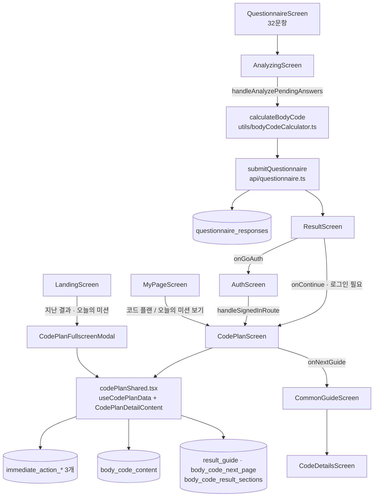
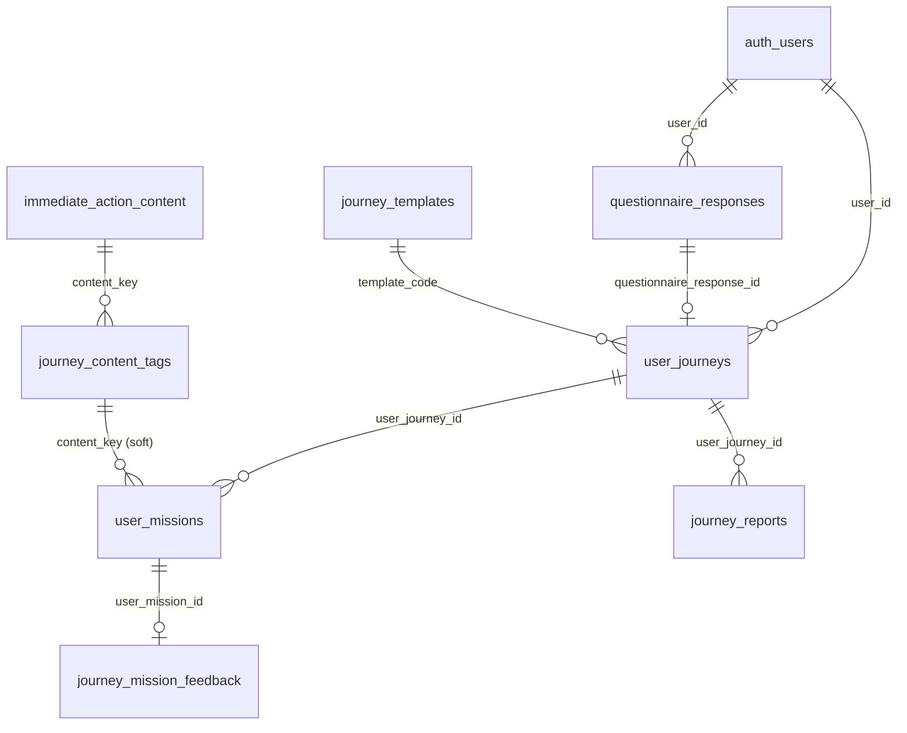
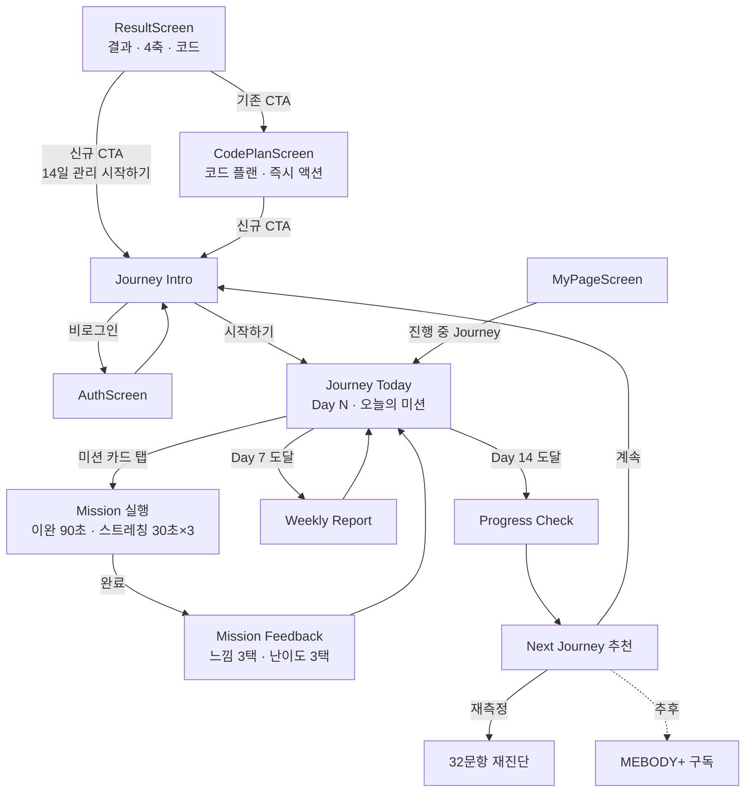

# MEBODY Journey 기술 설계

> 결과 페이지 이후 지속 관리 Journey 구축을 위한 기술 설계 문서
>
> 기준일: 2026-08-27 · 기준 저장소: `mebody-jjh` · 기준 문항 세트: `mebody_v1_32`
>
> **이 문서는 설계안이며 아직 구현하지 않았습니다.** 코드 변경은 0건입니다.

## 문서의 사실 기준

- 앱 소스 전체(`src/**`), DB 마이그레이션(`db/v1/**`), 서버 소스(`mebody-server/src/**`)를 직접 읽었습니다.
- 운영 Supabase 스키마와 행 수를 read-only로 직접 조회해 확인했습니다(2026-08-27).
- README와 실제 구현이 다른 항목은 **실제 코드·DB를 기준**으로 쓰고 차이를 [1.6](#16-readme와-실제-구현의-차이)에 명시했습니다.

상태 표기는 README와 동일합니다.

| 상태 | 의미 |
|---|---|
| `완료` | 현재 코드와 배포 흐름에 연결되어 있음 |
| `부분 구현` | 화면, 데이터 또는 기반 구조 일부만 존재함 |
| `미구현` | 현재 동작하는 기능이 없음 |
| `추후 확장` | 방향만 열어 두었고 구현을 약속하거나 확정하지 않음 |
| `확인 필요` | 코드·문구·운영 정책 사이의 정리가 필요함 |

## 이번 설계의 확정 사항

| 결정 | 선택 | 근거 |
|---|---|---|
| 데이터 소유 | **Supabase 직접 접근** | 기존 `api/questionnaire.ts`·`api/account.ts`와 동일 방식. "Spring 서버 없이도 진단·결과가 동작한다"는 원칙 유지 |
| 기존 `missions`·`user_mission_progress` | **건드리지 않고 신규 `journey_*` 테이블 생성** | 두 테이블은 Spring JPA 엔티티가 매핑 중이고 누적 카운터 구조(`current_count`/`target_count`)라 일일 미션·Day·피드백 모델과 맞지 않음 |
| 미션 콘텐츠 소스 | **`immediate_action_content` 23행 재사용** | 이미 이완 90초 + 스트레칭 30초×3세트, 타겟 근육·방향·도구·주의사항까지 채워져 있음 |
| Journey 진입 조건 | **로그인 필수** | Day 진행과 피드백 이력이 계정에 쌓여야 하며, 현재 코드 플랜 진입 정책과 동일 |

---

# 1. Current Architecture

## 1.1 결과 이후 화면·데이터 흐름



## 1.2 결과 이후 코드 위치 (실측)

| 항목 | 파일 · 위치 | 상태 |
|---|---|---|
| 화면 전환 | [src/App.tsx](../src/App.tsx) — 라우터 없음. `Screen` 유니온 + `useState`, 결과 ID만 `?result=`로 `replaceState` | `완료` |
| 결과 페이지 | [src/components/ResultScreen.tsx](../src/components/ResultScreen.tsx) (1104줄) | `완료` |
| 코드 플랜 화면 | [src/components/CodePlanScreen.tsx](../src/components/CodePlanScreen.tsx) (297줄) | `완료` |
| 코드 플랜 본문 | [src/components/codePlanShared.tsx](../src/components/codePlanShared.tsx) (1367줄) — 화면 3곳이 공유 | `완료` |
| 코드 플랜 모달 | [src/components/CodePlanFullscreenModal.tsx](../src/components/CodePlanFullscreenModal.tsx) — 랜딩에서 진입 | `완료` |
| **오늘의 미션 수행률 UI** | [codePlanShared.tsx:980](../src/components/codePlanShared.tsx#L980) `useState<MissionProgress>(0)`, 렌더는 [1103줄](../src/components/codePlanShared.tsx#L1103) | `부분 구현` |
| 즉시 액션 우선순위 | [codePlanShared.tsx:424](../src/components/codePlanShared.tsx#L424) `buildImmediateActionPlan`, [417줄](../src/components/codePlanShared.tsx#L417) `getSortedAxisCandidates` | `완료` |
| **15분 루틴 조합** | [codePlanShared.tsx:716](../src/components/codePlanShared.tsx#L716) `buildFifteenMinuteRoutine` | `부분 구현` |
| 4축·16코드 계산 | [src/utils/bodyCodeCalculator.ts](../src/utils/bodyCodeCalculator.ts) + [src/data/v1ScoreMapping.ts](../src/data/v1ScoreMapping.ts) (번들 96행) | `완료` |
| 결과 저장·조회 | [src/api/questionnaire.ts](../src/api/questionnaire.ts) | `완료` |
| 계정·멤버십 | [src/api/account.ts](../src/api/account.ts) | `부분 구현` |
| 콘텐츠 조회 | [src/api/content.ts](../src/api/content.ts) | `완료` |

## 1.3 오늘의 미션 수행률의 실제 동작

```
missionProgress: 0 → 50 → 100  (useState, 단조 증가만 허용)
카드 탭 → openActionDetailByProgress()
  0   → 1순위 상세 모달 + progress 50
  50  → 2순위 상세 모달 + progress 100
  100 → 전체 보기(all)
```

- **DB에 저장하지 않습니다.** 새로고침·화면 이동 시 0으로 초기화됩니다.
- "미션 완료"라는 개념이 없고 **상세 모달을 열었는가**만 기록합니다.
- 시작·완료 시각, 느낌, 난이도 같은 피드백은 수집하지 않습니다.

## 1.4 15분 루틴의 실제 조합 로직

`buildFifteenMinuteRoutine(body_code_content.exercises)`

1. `exercises`가 없으면 하드코딩 2개(목 5분 / 어깨 7분)를 사용합니다.
2. `duration` 문자열에서 첫 숫자만 뽑아 분으로 변환합니다.
3. 합이 15분 미만이면 "마무리 정렬 체크" 항목을 넣어 15분을 채웁니다.
4. 합이 15분 초과면 앞에서부터 잘라 15분에 맞춥니다.

**축·코드·우선순위·도구·난이도를 전혀 사용하지 않습니다.** 게다가 운영 DB의 `body_code_content.exercises`는 16개 코드가 모두 같은 값이라, 실제로는 어떤 코드로 진단해도 동일한 루틴이 나옵니다.

## 1.5 운영 Supabase 실측 (테이블 20개)

| 테이블 | 행 수 | 역할 | 앱 사용 |
|---|---|---|---|
| `questions` | 85 (active `mebody_v1_32` = **32**) | 문항 UI 정본 | `완료` |
| `question_choice_scores` | 96 | 선택지별 축·아이덴티티 점수(DB 정본) | 런타임은 번들 사용 |
| `questionnaire_responses` | 380 (completed 274, **user_id 보유 6**) | 결과 정본 | `완료` |
| `user_profiles` | 4 | 프로필 + `body_bti_code` 캐시 | `완료` |
| `body_code_content` | 16 | 코드별 설명·`exercises`·`health_products` | `완료`(단 `exercises`는 placeholder) |
| `body_code_result_sections` | 96 | 16코드 × 6섹션 | `완료` |
| `result_guide` | 4 | 공통/코드별 자세 사용 설명서 | `완료` |
| `body_code_next_page` | **1 (FRRS만)** | 코드 플랜 다음 장 | `부분 구현` |
| `immediate_action_content` | **23** | 이완/스트레칭 콘텐츠 | `완료` |
| `immediate_action_axis_mapping` | 8 (4축 × 2방향) | 축→콘텐츠 매핑 | `완료` |
| `immediate_action_discomfort_mapping` | 32 | 불편부위→콘텐츠 매핑 | 코드상 도달 불가([1.6](#16-readme와-실제-구현의-차이) 4번) |
| `app_content` | 1 (`advanced_tag_followups`) | 키-값 콘텐츠 | `완료` |
| `app_images` | 21 | 이미지 키-URL | `완료` |
| `missions` | **0** | Spring 미션 카탈로그 | 앱 미사용 |
| `user_mission_progress` | **0** | Spring 미션 진행 | 앱 미사용 |
| `body_bti_results` | 0 | Spring 결과 히스토리 | 앱 미사용 |
| `products` | 3 | 상품 shell | 앱 미사용 |
| `admin_audit_logs` | — | 관리자 감사 로그 | 앱 미사용 |
| `prompts` · `sere_contents` | — | 같은 Supabase 프로젝트의 타 용도 테이블 | 앱 미사용 |

### `immediate_action_content` 23행 구조 (Journey 콘텐츠의 기반)

| 구분 | 개수 | 예시 키 |
|---|---|---|
| `category_type = body_part` | 15 | `neck_right`, `shoulder_left`, `pelvis_right`, `knee_left`, `foot_right` … |
| `category_type = axis` | 8 | `axis_1F`, `axis_1C`, `axis_2R`, `axis_2L`, `axis_3R`, `axis_3L`, `axis_4S`, `axis_4F` |

모든 행이 동일한 시간 규격을 갖습니다.

- `release_duration_sec = 90`, `stretch_duration_sec = 30`, `sets = 3`
- 즉, **1개 콘텐츠 ≈ 90초 + 90초 = 약 3분**
- `release_tool`에 도구가 들어 있습니다: `손`, `폼롤러`, `마사지볼`, `폼롤러/마사지볼`, `마사지볼/테니스볼`, `손/폼롤러`
- `target_muscle`, `direction`(right/left/both), `caution`도 채워져 있습니다.

## 1.6 README와 실제 구현의 차이

| # | README 기술 | 실제 | 영향 |
|---|---|---|---|
| 1 | 앱이 `membership_plans`·`user_subscriptions`를 사용 | **두 테이블이 운영 DB에 없음**(PGRST205). `fetchMembershipPlans`는 `FALLBACK_PLANS`로, `fetchMySubscription`은 null로 조용히 넘어가지만 **`activateSubscription`은 실제로 실패** | "체크아웃 mock 동작"은 사실이 아님. 구독 게이팅을 Journey 전제로 둘 수 없음 |
| 2 | 미션 관리 = 앱 UI + 서버 기본 테이블 존재 | 서버 테이블 2개 모두 **0행**이고 앱은 `/api/me/missions`를 **호출하지 않음**. 앱의 수행률은 영속성 없는 로컬 state | Journey는 사실상 백지에서 시작 |
| 3 | 15분 루틴 부분 구현 | 16코드가 **4가지 조합만** 사용. 목(거북목 교정 5분 / 유지력 강화 3분)과 어깨(좌/우) 축만 반영하고 **골반·하체 축은 반영되지 않음**. 합계 10~12분을 "마무리 정렬 체크"로 15분에 맞춤 | 코드별 변별력이 4단계뿐. Journey 콘텐츠 소스로 쓰면 안 됨 |
| 4 | 즉시 액션이 불편부위(Case A)와 축(Case B)을 분기 | [codePlanShared.tsx:440,445](../src/components/codePlanShared.tsx#L440)가 **레거시 v3 코드 `A-1`/`A-3`를 읽음**. `mebody_v1_32`는 `A1`/`A3`(하이픈 없음)이고 `A1`은 "운동 빈도" | **Case A는 절대 실행되지 않고 항상 Case B(축 기반)** 로 동작. `immediate_action_discomfort_mapping` 32행은 현재 사용되지 않음 |
| 5 | — | [src/data/ver3QuestionsSnapshot.ts](../src/data/ver3QuestionsSnapshot.ts) 908줄이 어디에서도 import되지 않음 | dead code |
| 6 | 결과 유튜브가 `app_content` 기반 | `app_content`에 `result_youtube_videos` 키 없음 | 하드코딩 기본값 2개가 노출됨 |
| 7 | `questionnaire_responses` RLS 재점검 필요(P0) | **anon 키로 전 행이 읽힘**(타인 답변·`user_id` 포함) — 실측 확인. `user_profiles`·`missions`·`body_bti_results`는 anon 차단됨 | Journey 신규 테이블에서 반드시 피해야 할 패턴 |

> 위 7건은 이번 Journey 작업에서 **고치지 않습니다**(범위 밖). 다만 4·7번은 Journey 설계에 직접 영향을 주므로 아래 규칙과 리스크에 반영했습니다.

---

# 2. Reusable Components

## 2.1 그대로 재사용

| 자산 | 위치 | Journey에서의 용도 |
|---|---|---|
| `useCodePlanData(questionnaireId)` | [codePlanShared.tsx:481](../src/components/codePlanShared.tsx#L481) | 결과 + 축 퍼센트 + 콘텐츠를 한 번에 로드. Journey Intro/Today가 그대로 사용 |
| `getSortedAxisCandidates` · `AXIS_TIE_PRIORITY` | [codePlanShared.tsx:417](../src/components/codePlanShared.tsx#L417), [289줄](../src/components/codePlanShared.tsx#L289) | **관리 우선순위(P1/P2) 계산의 정본**. Journey 추천 규칙이 이 함수를 그대로 씀 |
| `AxisRow` 타입 · `AXIS_META` | [codePlanShared.tsx:38](../src/components/codePlanShared.tsx#L38), [104줄](../src/components/codePlanShared.tsx#L104) | 축 키·방향 코드·라벨·`axisLookupKey`(neck/shoulder/pelvis/lower) |
| `getAxisScoreBreakdown` | [bodyCodeCalculator.ts:410](../src/utils/bodyCodeCalculator.ts#L410) | 축별 좌우 퍼센트 |
| `calculateBodyCode` | [bodyCodeCalculator.ts:208](../src/utils/bodyCodeCalculator.ts#L208) | 재측정 비교 시 이전/이후 `scoringMeta` 대조 |
| `fetchImmediateActionData()` + 캐시·재시도 | [content.ts:234](../src/api/content.ts#L234) | 미션 콘텐츠 23행 로드. **Journey도 이 캐시를 공유** |
| `dedupeContents` | [codePlanShared.tsx:329](../src/components/codePlanShared.tsx#L329) | 같은 근육·방향 중복 제거 |
| `InstructionBlock` | [codePlanShared.tsx:765](../src/components/codePlanShared.tsx#L765) | 이완/스트레칭 단계 렌더 — 미션 실행 화면에 재사용 |
| `ActionDetailOverlay` | [codePlanShared.tsx:790](../src/components/codePlanShared.tsx#L790) | 미션 상세 오버레이의 시각적 기준 |
| `fetchQuestionnaireResult` | [questionnaire.ts:488](../src/api/questionnaire.ts#L488) | 결과 + `body_code_content` 동시 로드, 로컬 결과 fallback 포함 |
| `fetchLatestCompletedResultForUser` | [account.ts:156](../src/api/account.ts#L156) | Journey 시작 시 연결할 결과 결정 |
| `attachQuestionnaireResultToUser` | [account.ts:313](../src/api/account.ts#L313) | 로그인 직후 결과 귀속 |
| `supabase` · `SUPABASE_STORAGE_PUBLIC` | [lib/supabase.ts](../src/lib/supabase.ts) | 단일 클라이언트 |
| `getSessionWithFallback` · `getStoredSupabaseSession` | [lib/authSession.ts](../src/lib/authSession.ts) | 세션 조회 타임아웃 대응 |
| `AXIS_GREEN_THEME` | [data/axisTheme.ts](../src/data/axisTheme.ts) | Journey 화면 색 토큰 |
| `resolveCharacterImageUrl` | [utils/characterImages.ts](../src/utils/characterImages.ts) | 캐릭터 이미지 3단 fallback |
| `ScrollIndicator` · `useMediaQuery` | [components/ScrollIndicator.tsx](../src/components/ScrollIndicator.tsx), [utils/useMediaQuery.ts](../src/utils/useMediaQuery.ts) | 스크롤 힌트 · 데스크톱 목업 |
| `withTimeout` · `isMissingTableOrColumn` 패턴 | [questionnaire.ts:261](../src/api/questionnaire.ts#L261), [account.ts:76](../src/api/account.ts#L76) | Journey API도 같은 방어 패턴 사용 |

## 2.2 주의해서 재사용

| 자산 | 주의점 |
|---|---|
| `buildImmediateActionPlan` | 불편부위 분기가 죽어 있음([1.6](#16-readme와-실제-구현의-차이) 4번). Journey는 **`getSortedAxisCandidates`만 재사용**하고 이 함수 전체는 호출하지 않음 |
| `buildFifteenMinuteRoutine` | `body_code_content.exercises`가 placeholder. Journey 콘텐츠 소스로 쓰지 않음. 15분 루틴은 별도 과제로 유지 |
| `CodePlanDetailContent` | 결과·코드 플랜·랜딩 모달 3곳이 공유. 수정 시 3곳 동시 영향 → Journey 연동은 **옵셔널 prop**으로만 |
| `missions` · `user_mission_progress` | Spring JPA 엔티티가 매핑 중. 스키마 변경 금지 |

## 2.3 재사용하지 않는 것

- `src/data/ver3QuestionsSnapshot.ts` — dead code
- `immediate_action_discomfort_mapping` — 32문항에 불편부위 문항이 없어 V1에서는 사용 불가(확장 지점으로만 남김)
- `/api/me/missions` (Spring) — 앱은 Supabase 직접 접근을 유지

---

# 3. Missing Components

Journey 구현에 새로 필요한 것만 정리했습니다.

| 영역 | 필요한 것 | 현재 |
|---|---|---|
| 상태 | Journey 상태 머신(`active`/`completed`/`abandoned`), `current_day` 계산, 미접속 감지 | `미구현` |
| 데이터 | Journey 6개 테이블 + RLS 정책 + 시드 | `미구현` |
| 콘텐츠 메타 | 콘텐츠별 축·방향·난이도·도구·기본 시간 태그 | `미구현`(원본 23행에는 도구·시간만 있음) |
| 추천 | Rule-Based 미션 배정 엔진(`selectDailyMissions`) | `미구현` |
| 기록 | 미션 시작/완료 시각, 완료 상태 | `미구현` |
| 피드백 | `feeling`(BETTER/SAME/UNCOMFORTABLE) · `difficulty`(EASY/GOOD/HARD) 수집·저장 | `미구현` |
| 조정 | 피드백 → 다음 미션 강도/콘텐츠 조정 | `미구현` |
| 리포트 | Day 7 Weekly Report, Day 14 Progress Check 집계 | `미구현` |
| 재측정 | 이전/이후 결과 비교(`scoring_meta` 대조) | `미구현` |
| 추천 | Next Journey 제안 | `미구현` |
| API | `src/api/journey.ts` | `미구현` |
| 화면 | Journey Intro / Today / Mission / Feedback / Report | `미구현` |
| 구독 | 결제·구독 게이팅 | `미구현`(테이블 자체가 없음) |

---

# 4. Proposed Domain Model

## 4.1 설계 원칙

**16개 코드 × 14일 프로그램을 하드코딩하지 않습니다.**

`JourneyTemplate`은 "Day 슬롯의 규칙"만 갖고, 실제 콘텐츠는 아래 입력으로 런타임에 조합합니다.

```
body_code + axis + axis_score + priority
  + mission target + mission type + duration + difficulty + equipment
  + user feedback + completion history
        → daily mission
```

## 4.2 논리 엔티티 ↔ 물리 테이블

| 논리 엔티티 | 물리 | 설명 |
|---|---|---|
| **Journey** | (개념) | 하나의 관리 프로그램 단위. V1에서는 `JourneyTemplate` 인스턴스 = `UserJourney`이므로 별도 테이블 없음 |
| **JourneyTemplate** | `journey_templates` | 기간(14일)과 Day 슬롯 규칙(`day_plan` jsonb). 코드별 분기 없음 |
| **MissionContent** | **`immediate_action_content`(기존 23행) 재사용** | 이완/스트레칭 본문, 도구, 타겟 근육, 방향, 주의사항 |
| **Mission**(카탈로그) | `journey_content_tags` | MissionContent에 축·방향·타입·난이도·기본시간·도구를 붙인 "선택 가능한 미션 후보". 규칙 엔진의 입력 |
| **UserJourney** | `user_journeys` | 사용자가 시작한 Journey 1건. 시작 시점의 `body_code`·`axis_priority` 스냅샷 보관 |
| **UserMission** | `user_missions` | 특정 사용자·Day·슬롯에 배정된 미션 인스턴스. 시작/완료 시각과 상태 |
| **MissionFeedback** | `journey_mission_feedback` | UserMission 1건당 1건. `feeling`·`difficulty` |
| **WeeklyReport** | `journey_reports` (`report_type='weekly'`) | Day 7 집계 스냅샷 |
| **ProgressCheck** | `journey_reports` (`report_type='progress_check'`) | Day 14 집계 + 재측정 안내 |

WeeklyReport와 ProgressCheck는 저장 구조가 같고 집계 범위와 화면만 달라서 **한 테이블 + `report_type`** 으로 둡니다.

## 4.3 관계



## 4.4 상태 전이

```
UserJourney : active ──(Day 14 완료)──> completed ──> (Next Journey 추천)
              active ──(사용자 중단)──> abandoned
              active ──(3일+ 미접속)──> active + Restart Mission 배정

UserMission : scheduled ──> started ──> completed ──> (feedback 1건)
              scheduled ──> skipped
```

---

# 5. Proposed Supabase Schema

## 5.1 재사용안 우선

신규 테이블을 만들기 전에 **기존 자산으로 덮을 수 있는 부분**입니다.

| 필요한 것 | 재사용 대상 | 판단 |
|---|---|---|
| 미션 콘텐츠 본문 | **`immediate_action_content` (23행)** | **재사용.** 신규 콘텐츠 테이블 불필요 |
| 축 → 콘텐츠 매핑 | **`immediate_action_axis_mapping` (8행)** | **재사용.** 4축 × 2방향이 이미 콘텐츠 키로 연결됨 |
| 진단 정본 | **`questionnaire_responses`** | **재사용.** `answers`·`calculated_code`·`scoring_meta` 그대로 |
| 사용자 | **`user_profiles` + `auth.users`** | **재사용.** 신규 사용자 테이블 불필요 |
| 코드별 설명 | **`body_code_content`·`body_code_result_sections`** | **재사용.** 리포트 문구에 활용 |
| 미션 진행 기록 | `user_mission_progress` | **재사용 불가.** 누적 카운터 1행 구조라 Day/슬롯/피드백을 표현할 수 없고, Spring JPA 엔티티가 매핑 중이라 스키마 변경이 위험 |
| 미션 카탈로그 | `missions` | **재사용 불가.** `title`/`target_count`만 있어 축·난이도·도구를 담을 수 없음 |
| 구독 게이팅 | `membership_plans`·`user_subscriptions` | **불가.** 운영 DB에 테이블 자체가 없음 |

결론: **신규 테이블 6개**만 만들고, 기존 테이블은 한 개도 변경하지 않습니다.

## 5.2 신규 테이블

### `journey_templates` — 카탈로그, 공개 읽기

| 컬럼 | 타입 | 비고 |
|---|---|---|
| `id` | uuid PK | |
| `code` | text UNIQUE | `starter_14d` |
| `name` · `description` | text | |
| `duration_days` | int | 14 |
| `day_plan` | jsonb | Day별 슬롯 규칙(아래) |
| `is_active` | boolean | |
| `created_at` · `updated_at` | timestamptz | |

`day_plan` 예시(코드별 분기가 아니라 **슬롯 규칙**만 담습니다):

```json
{
  "days": [
    { "day": 1,  "slots": [{ "axis_rank": 1, "mission_type": "combo" }], "kind": "normal" },
    { "day": 2,  "slots": [{ "axis_rank": 2, "mission_type": "combo" }], "kind": "normal" },
    { "day": 7,  "slots": [{ "axis_rank": 1, "mission_type": "release" },
                           { "axis_rank": 2, "mission_type": "stretch" }], "kind": "weekly_report" },
    { "day": 14, "slots": [{ "axis_rank": 1, "mission_type": "combo" },
                           { "axis_rank": 2, "mission_type": "combo" }], "kind": "progress_check" }
  ]
}
```

### `journey_content_tags` — 카탈로그, 공개 읽기

`immediate_action_content` 23행에 규칙 엔진이 필요한 메타를 붙입니다.

| 컬럼 | 타입 | 비고 |
|---|---|---|
| `id` | uuid PK | |
| `content_key` | text | `immediate_action_content.content_key` 참조(soft ref) |
| `axis_key` | text | `neck` \| `shoulder` \| `pelvis` \| `lower` \| null(body_part 전용) |
| `direction_key` | text | `F`/`C`/`R`/`L`/`S`/`both` |
| `body_part_key` | text | `neck`, `shoulder`, `waist`, `pelvis`, `knee`, `ankle`, `foot` … |
| `mission_type` | text | `release` \| `stretch` \| `combo` |
| `difficulty` | int | 1~3 |
| `base_duration_sec` | int | 기본 180 (90 + 30×3) |
| `equipment` | text[] | `{손}`, `{폼롤러,마사지볼}` — `release_tool` 문자열을 파싱해 시드 |
| `is_active` | boolean | |

시드: axis 콘텐츠 8행 + body_part 콘텐츠 15행 = **23행**. `axis_1F` → `axis_key='neck', direction_key='F'` 식으로 `immediate_action_axis_mapping`에서 기계적으로 채웁니다.

> `immediate_action_content.content_key`에 UNIQUE 제약이 없습니다. 실제 데이터는 유일하므로 시드 전에 `CREATE UNIQUE INDEX immediate_action_content_content_key_uidx ON public.immediate_action_content (content_key);`를 **추가만** 하는 것을 권고합니다(기존 컬럼·행 변경 없음). 제약을 추가하지 않기로 하면 FK 없이 soft reference로 둡니다.

### `user_journeys` — 사용자 데이터, RLS

| 컬럼 | 타입 | 비고 |
|---|---|---|
| `id` | uuid PK | |
| `user_id` | uuid NOT NULL | → `auth.users(id)` ON DELETE CASCADE |
| `questionnaire_response_id` | uuid | → `questionnaire_responses(id)` ON DELETE SET NULL |
| `template_code` | text | → `journey_templates.code` |
| `body_code` | text | 시작 시점 스냅샷 |
| `axis_priority` | jsonb | `[{ "rank":1,"axis":"pelvis","direction":"R","percent":72 }, …]` 스냅샷 |
| `status` | text | `active` \| `completed` \| `abandoned` |
| `current_day` | int | 1~14 |
| `started_at` · `last_active_at` · `completed_at` | timestamptz | |
| `created_at` · `updated_at` | timestamptz | |

- `CREATE UNIQUE INDEX user_journeys_one_active_uidx ON user_journeys (user_id) WHERE status = 'active';`
- `CREATE INDEX user_journeys_user_idx ON user_journeys (user_id, started_at DESC);`
- **결과 ID가 `local-result-`로 시작하면 FK를 걸 수 없습니다.** Journey는 로그인 필수이고 로그인 사용자의 결과는 DB에 저장되므로, 시작 시 `questionnaire_response_id`가 UUID인지 검증합니다.

### `user_missions` — 사용자 데이터, RLS

| 컬럼 | 타입 | 비고 |
|---|---|---|
| `id` | uuid PK | |
| `user_journey_id` | uuid NOT NULL | → `user_journeys(id)` ON DELETE CASCADE |
| `user_id` | uuid NOT NULL | RLS 단순화를 위한 비정규화 |
| `day_no` | int NOT NULL | 1~14 |
| `slot_no` | int NOT NULL | 1부터 |
| `content_key` | text NOT NULL | `journey_content_tags.content_key` |
| `mission_type` | text | `release` \| `stretch` \| `combo` |
| `planned_duration_sec` | int | 규칙 엔진이 계산한 값 |
| `difficulty` | int | 1~3 |
| `source_rule` | text | `axis_p1`, `axis_p2`, `restart`, `substitute` — 왜 이 미션이 나왔는지 추적 |
| `status` | text | `scheduled` \| `started` \| `completed` \| `skipped` |
| `started_at` · `completed_at` | timestamptz | |
| `created_at` · `updated_at` | timestamptz | |

- `UNIQUE (user_journey_id, day_no, slot_no)`
- `CREATE INDEX user_missions_journey_day_idx ON user_missions (user_journey_id, day_no);`

### `journey_mission_feedback` — 사용자 데이터, RLS

| 컬럼 | 타입 | 비고 |
|---|---|---|
| `id` | uuid PK | |
| `user_mission_id` | uuid UNIQUE NOT NULL | → `user_missions(id)` ON DELETE CASCADE |
| `user_id` | uuid NOT NULL | |
| `feeling` | text | CHECK `BETTER` \| `SAME` \| `UNCOMFORTABLE` |
| `difficulty` | text | CHECK `EASY` \| `GOOD` \| `HARD` |
| `note` | text | 선택 입력 |
| `created_at` | timestamptz | |

### `journey_reports` — 사용자 데이터, RLS

| 컬럼 | 타입 | 비고 |
|---|---|---|
| `id` | uuid PK | |
| `user_journey_id` | uuid NOT NULL | → `user_journeys(id)` ON DELETE CASCADE |
| `user_id` | uuid NOT NULL | |
| `report_type` | text | CHECK `weekly` \| `progress_check` |
| `day_no` | int | 7 또는 14 |
| `payload` | jsonb | 집계 스냅샷(완료율, feeling 분포, difficulty 분포, 축별 수행 횟수, 제외된 콘텐츠) |
| `created_at` | timestamptz | |

- `UNIQUE (user_journey_id, report_type, day_no)`

## 5.3 RLS 정책

```sql
-- 카탈로그 2개: 읽기 전용 공개
ALTER TABLE public.journey_templates     ENABLE ROW LEVEL SECURITY;
ALTER TABLE public.journey_content_tags  ENABLE ROW LEVEL SECURITY;
CREATE POLICY journey_templates_read    ON public.journey_templates
  FOR SELECT TO anon, authenticated USING (is_active);
CREATE POLICY journey_content_tags_read ON public.journey_content_tags
  FOR SELECT TO anon, authenticated USING (is_active);

-- 사용자 테이블 4개: 본인 행만 (anon 전면 차단)
ALTER TABLE public.user_journeys             ENABLE ROW LEVEL SECURITY;
ALTER TABLE public.user_missions             ENABLE ROW LEVEL SECURITY;
ALTER TABLE public.journey_mission_feedback  ENABLE ROW LEVEL SECURITY;
ALTER TABLE public.journey_reports           ENABLE ROW LEVEL SECURITY;

CREATE POLICY user_journeys_own ON public.user_journeys
  FOR ALL TO authenticated
  USING (auth.uid() = user_id) WITH CHECK (auth.uid() = user_id);
-- user_missions / journey_mission_feedback / journey_reports 동일 패턴
```

**원칙: `questionnaire_responses`가 anon에 전 행 노출된 상태([1.6](#16-readme와-실제-구현의-차이) 7번)를 Journey 테이블에서 반복하지 않습니다.** 신규 사용자 테이블은 `anon` 역할에 어떤 권한도 부여하지 않고, 배포 후 anon 키로 `select` 시 빈 배열이 나오는지 반드시 확인합니다.

---

# 6. Recommendation Rule

## 6.1 V1은 Rule-Based

AI 추천은 사용하지 않습니다. 모든 결정은 결정적(deterministic)이며, 같은 입력이면 같은 미션이 나옵니다.

## 6.2 입력

| 입력 | 출처 |
|---|---|
| `body_code` | `user_journeys.body_code` (시작 시 스냅샷) |
| `axis` · `axis_score` · `priority` | `user_journeys.axis_priority` — `getSortedAxisCandidates(axisRows)` 결과를 저장 |
| `journey day` | `user_journeys.current_day` |
| `previous feedback` | `journey_mission_feedback` 최근 N건 |
| `completion history` | `user_missions` 상태 집계 |
| `available duration` | 사용자가 Today 화면에서 선택(5분 / 15분), 기본 5분 |
| `mission target` · `type` · `difficulty` · `equipment` | `journey_content_tags` |

## 6.3 관리 우선순위 산출

기존 함수를 그대로 씁니다.

```ts
// codePlanShared.tsx:417 재사용
const candidates = getSortedAxisCandidates(axisRows);
// dominantPercent 내림차순 → 동률이면 AXIS_TIE_PRIORITY(하체 > 골반 > 어깨 > 목)
const p1 = candidates[0];  // 예: pelvis / R / 72%
const p2 = candidates[1];  // 예: neck   / F / 68%
```

Journey 시작 시 이 결과를 `user_journeys.axis_priority`에 **스냅샷으로 저장**합니다. 진행 중 결과가 바뀌어도 14일 프로그램이 흔들리지 않게 하기 위함입니다.

> 불편부위 기반 우선순위(Case A)는 `mebody_v1_32`에 해당 문항이 없어 V1에서 제외합니다([1.6](#16-readme와-실제-구현의-차이) 4번). 32문항에 불편부위 문항이 추가되면 `axis_priority` 앞에 `discomfort` 항목을 끼워 넣는 방식으로 확장합니다. → `추후 확장`

## 6.4 Day 슬롯 규칙

| Day | 구성 |
|---|---|
| 홀수일(1,3,5,9,11,13) | P1축 미션 1개 |
| 짝수일(2,4,6,8,10,12) | P2축 미션 1개 |
| Day 7 | P1 + P2 각 1개 + **Weekly Report** |
| Day 14 | P1 + P2 각 1개 + **Progress Check** |

시간 예산(단위 콘텐츠 ≈ 180초):

| 가용 시간 | 슬롯 |
|---|---|
| 5분 | 콘텐츠 1개 (약 3분) + 정리 |
| 15분 | 콘텐츠 3~4개 (P1 2개 + P2 1~2개) |

## 6.5 미션 선택 의사코드

```ts
function selectDailyMissions(input): PlannedMission[] {
  const daySpec   = template.day_plan.days.find(d => d.day === input.dayNo);
  const excluded  = contentKeysWithFeedback(input.feedback, 'UNCOMFORTABLE');
  const budgetSec = input.availableMinutes * 60;

  // 0) 미접속 복귀 처리 — 다른 규칙보다 우선
  if (daysSince(input.lastActiveAt) >= 3) {
    return [restartMission(input.axisPriority[0], excluded)];
    // difficulty 1, 콘텐츠 1개, planned_duration_sec = base / 2, source_rule = 'restart'
  }

  const out: PlannedMission[] = [];
  let remaining = budgetSec;

  for (const slot of daySpec.slots) {
    const axis = input.axisPriority[slot.axis_rank - 1];

    // 1) 후보: 해당 축·방향의 콘텐츠, 제외 목록 반영
    let pool = contentTags.filter(t =>
      t.is_active &&
      t.axis_key === axis.axisLookupKey &&
      (t.direction_key === axis.direction || t.direction_key === 'both') &&
      !excluded.has(t.content_key));

    // 2) 대체: 축 콘텐츠가 모두 제외되면 같은 부위의 body_part 콘텐츠로 대체
    if (pool.length === 0) {
      pool = contentTags.filter(t =>
        t.body_part_key === axisToBodyPart(axis.axisLookupKey) &&
        !excluded.has(t.content_key));
      slot.source_rule = 'substitute';
    }
    if (pool.length === 0) continue;

    // 3) 난이도: 최근 피드백으로 조정 (1~3 범위 clamp)
    const targetDifficulty = adjustDifficulty(baseDifficultyFor(input.dayNo), input.feedback);

    // 4) 반복 회피: 최근 3일간 사용한 content_key는 후순위
    const picked = pickClosest(pool, targetDifficulty, input.recentContentKeys);

    // 5) 시간: 난이도에 따라 세트/시간 스케일
    const duration = scaleDuration(picked.base_duration_sec, input.feedback);
    if (duration > remaining && out.length > 0) break;

    out.push({ ...picked, planned_duration_sec: duration, difficulty: targetDifficulty });
    remaining -= duration;
  }
  return out;
}
```

## 6.6 피드백 → 다음 미션 조정 규칙

| 피드백 | 적용 | 구현 |
|---|---|---|
| `difficulty = HARD` | 다음 미션 강도 감소 | `difficulty - 1`(최소 1), `planned_duration_sec × 0.7`, 세트 3 → 2 |
| `difficulty = EASY` | 난이도·시간 소폭 증가 | `difficulty + 1`(최대 3), `planned_duration_sec × 1.2`, 세트 3 → 4 |
| `difficulty = GOOD` | 유지 | 변화 없음 |
| `feeling = UNCOMFORTABLE` | 해당 콘텐츠 제외 또는 대체 | `content_key`를 남은 Day 전체에서 제외. 같은 축의 다른 방향 → 같은 부위 body_part 콘텐츠 순으로 대체(`source_rule='substitute'`) |
| `feeling = BETTER` | 유지·강화 | 해당 `content_key` 가중치 +1 (같은 축 내 우선 선택) |
| `feeling = SAME` | 유지 | 변화 없음 |
| 3일 이상 미접속 | Restart Mission | 난이도 1, 콘텐츠 1개, 시간 절반, `source_rule='restart'`. `current_day`는 증가시키지 않음 |

조정은 **직전 1건이 아니라 최근 3건의 다수결**로 판단해 한 번의 답변으로 프로그램이 크게 흔들리지 않게 합니다.

## 6.7 리포트 집계 규칙

`journey_reports.payload`에 저장할 값(모두 `user_missions` + `journey_mission_feedback` 집계):

```json
{
  "period": { "from_day": 1, "to_day": 7 },
  "completion": { "scheduled": 7, "completed": 5, "skipped": 2, "rate": 71 },
  "feeling":    { "BETTER": 3, "SAME": 2, "UNCOMFORTABLE": 0 },
  "difficulty": { "EASY": 1, "GOOD": 3, "HARD": 1 },
  "axis_focus": { "pelvis": 4, "neck": 3 },
  "excluded_content_keys": [],
  "next_hint": "다음 주는 골반 축 시간을 소폭 늘립니다"
}
```

Day 14 `progress_check`는 위에 더해 **재측정 CTA**를 포함합니다. 재측정 비교는 `questionnaire_responses.scoring_meta.axis`의 이전/이후 값을 대조합니다. → Phase 6

---

# 7. Screen Flow

## 7.1 전체 흐름



## 7.2 `App.tsx` 화면 추가

```ts
type Screen =
  | 'landing' | 'consent' | 'intro' | 'questionnaire' | 'analyzing'
  | 'result' | 'codePlan' | 'guideCommon' | 'guideDetails'
  | 'auth' | 'membership' | 'checkout' | 'myPage'
  // 신규 5개
  | 'journeyIntro' | 'journeyToday' | 'journeyMission'
  | 'journeyReport' | 'journeyNext';
```

## 7.3 화면별 진입·이탈

| 화면 | 진입 | 이탈 | 로그인 |
|---|---|---|---|
| Journey Intro | Result·CodePlan·MyPage CTA | 시작 → Today / 뒤로 → 진입 화면 | **필수**(비로그인은 `openAuth('journeyIntro')`) |
| Journey Today | Intro 시작, MyPage 이어하기, Feedback 완료 후 | 미션 탭 → Mission / Day 7·14 → Report | 필수 |
| Mission | Today 미션 카드 | 완료 → Feedback / 닫기 → Today | 필수 |
| Feedback | 미션 완료 | 저장 → Today | 필수 |
| Weekly Report / Progress Check | Day 7·14 진입 시 자동, 이후 다시보기 | 닫기 → Today / Day 14 → Next | 필수 |
| Next Journey | Progress Check 종료 | 재측정 → `consent` / 계속 → Intro | 필수 |

## 7.4 기존 화면과의 관계

- **코드 플랜은 그대로 둡니다.** Journey는 코드 플랜을 대체하지 않고 병렬로 진입합니다.
- `ResultScreen`에는 **CTA 버튼 한 개만** 추가합니다(`onStartJourney` 옵셔널 prop). prop이 없으면 현재 화면과 100% 동일하게 렌더됩니다.
- `codePlanShared.tsx`의 `missionProgress`는 **기본 동작을 유지**하고, 옵셔널 prop(`journeyProgress`)이 주어질 때만 DB 값으로 대체합니다. → 랜딩 모달·코드 플랜 화면 회귀 없음.
- 라우터가 없으므로 Journey 화면은 URL을 갖지 않습니다. 딥링크는 `추후 확장`.

---

# 8. Implementation Plan

각 Phase는 독립적으로 배포 가능하며, Phase 1~2는 사용자 화면에 아무 변화가 없습니다.

## Phase 1 — DB 스키마 · RLS · 시드

| 항목 | 내용 |
|---|---|
| 수정 파일 | 없음 |
| 신규 파일 | `db/journey/020_journey_schema.sql`, `021_journey_rls.sql`, `022_seed_journey_template.sql`, `023_seed_journey_content_tags.sql`, `db/journey/README.md` |
| DB 변경 | 신규 테이블 6개 + 인덱스 + RLS. `immediate_action_content.content_key` UNIQUE 인덱스 **추가만**(권고). 기존 테이블 컬럼·행 변경 0 |
| UI 변경 | 없음 |
| API 변경 | 없음 |
| 테스트 | anon 키로 `journey_templates`·`journey_content_tags` 조회 시 행이 나오고, `user_journeys`·`user_missions`·`journey_mission_feedback`·`journey_reports`는 **빈 배열**인지 확인. 로그인 사용자로 본인 행 insert/select 확인. `npm run build` |
| 기존 기능 영향 | **없음**(신규 테이블만) |

## Phase 2 — API 계층

| 항목 | 내용 |
|---|---|
| 수정 파일 | 없음 |
| 신규 파일 | `src/api/journey.ts`, `src/utils/journeyRules.ts` |
| 함수 | `fetchActiveJourney(userId)`, `startJourney({userId, resultId, bodyCode, axisPriority})`, `fetchTodayMissions(journeyId, dayNo)`, `ensureDayMissions(...)`(규칙 엔진 실행 + upsert), `startMission(id)`, `completeMission(id)`, `saveMissionFeedback(...)`, `buildReport(journeyId, type, dayNo)`, `fetchReport(...)` |
| DB 변경 | 없음 |
| UI 변경 | 없음 |
| API 변경 | 신규 모듈만 추가. 기존 `api/*.ts` 무변경 |
| 테스트 | 임시 스크립트(`scripts/verify-journey.mjs`)로 시작 → Day 1 배정 → 완료 → 피드백 → Day 2 조정 확인. `journeyRules.ts`는 순수 함수라 입력/출력 단위 확인 가능 |
| 기존 기능 영향 | **없음**(어느 화면도 import하지 않음) |

## Phase 3 — Journey Intro · Today

| 항목 | 내용 |
|---|---|
| 수정 파일 | `src/App.tsx`(Screen 3개 추가 + lazy import + 분기), `src/components/ResultScreen.tsx`(옵셔널 `onStartJourney` CTA 1개) |
| 신규 파일 | `src/components/journey/JourneyIntroScreen.tsx`, `JourneyTodayScreen.tsx`, `journeyShared.tsx` |
| DB 변경 | 없음 |
| UI 변경 | 결과 페이지에 CTA 1개 추가, Journey 화면 2개 신규 |
| API 변경 | Phase 2 모듈 소비 |
| 테스트 | 로그인 → 결과 → Journey 시작 → Day 1 미션 노출. 비로그인 → CTA → Auth → 복귀. 서버(Spring) 꺼진 상태에서 동작 확인 |
| 기존 기능 영향 | `ResultScreen`은 prop 미전달 시 기존과 동일. `App.tsx`는 분기 추가만 |

## Phase 4 — Mission 실행 · Feedback

| 항목 | 내용 |
|---|---|
| 수정 파일 | `src/App.tsx`, `src/components/codePlanShared.tsx`(**옵셔널 prop `journeyProgress`만 추가**, 기본값은 현행 로컬 state) |
| 신규 파일 | `src/components/journey/JourneyMissionScreen.tsx`, `MissionFeedbackSheet.tsx` |
| DB 변경 | 없음 |
| UI 변경 | 미션 실행 화면(타이머·`InstructionBlock` 재사용), 피드백 시트(느낌 3택 / 난이도 3택) |
| API 변경 | `startMission` · `completeMission` · `saveMissionFeedback` 연결 |
| 테스트 | 미션 시작 → 완료 → 피드백 저장 → `user_missions.completed_at`·`journey_mission_feedback` 행 확인. `HARD` 저장 후 다음 날 미션 강도 감소, `UNCOMFORTABLE` 저장 후 해당 콘텐츠 제외 확인 |
| 기존 기능 영향 | `codePlanShared` 수정은 **prop 추가 1개**. 결과·코드 플랜·랜딩 모달 3화면 모두 회귀 확인 필요 |

## Phase 5 — Weekly Report · Progress Check · Next Journey

| 항목 | 내용 |
|---|---|
| 수정 파일 | `src/App.tsx`, `src/components/MyPageScreen.tsx`(진행 중 Journey 카드 추가) |
| 신규 파일 | `src/components/journey/JourneyReportScreen.tsx`, `JourneyNextScreen.tsx` |
| DB 변경 | 없음 |
| UI 변경 | 리포트 화면, 다음 Journey 추천 화면, 마이페이지 카드 |
| API 변경 | `buildReport` · `fetchReport` 연결 |
| 테스트 | Day 7 도달 시 리포트 1회 생성 + 재진입 시 중복 생성 안 됨(UNIQUE). Day 14 → Progress Check → Next Journey |
| 기존 기능 영향 | 마이페이지에 섹션 1개 추가. 기존 섹션 무변경 |

## Phase 6 — 재측정 연결 · 구독 자리

| 항목 | 내용 |
|---|---|
| 수정 파일 | `src/components/journey/JourneyNextScreen.tsx`, `src/api/journey.ts` |
| 신규 파일 | `src/utils/journeyCompare.ts`(이전/이후 `scoring_meta.axis` 비교) |
| DB 변경 | 없음 |
| UI 변경 | 재측정 전후 비교 카드 |
| API 변경 | 재측정 결과로 새 Journey 시작 |
| 기존 기능 영향 | 재측정은 기존 `startNewDiagnosis()` 흐름을 그대로 사용 |
| 비고 | **구독 게이팅은 구현하지 않습니다.** `membership_plans`·`user_subscriptions` 테이블이 없어 선행 과제(P0 TODO)가 끝나야 합니다. 화면에는 자리만 둡니다 → `추후 확장` |

## 8.1 공통 테스트 절차

```bash
cd mebody-jjh && npm run build && git diff --check
```

Phase마다 아래 회귀 목록을 수동 확인합니다.

1. 랜딩 → 동의 → 안내 → **32문항** 완주
2. 완료 후 분석 화면 → **결과 페이지** 진입, 4축 그래프·코드·캐릭터 정상
3. Supabase 저장 실패를 강제(네트워크 차단)해도 결과 화면이 뜨는지
4. 로그인 → 코드 플랜 → 즉시 액션 1·2순위 카드와 상세 모달
5. 랜딩 "지난 결과 · 오늘의 미션" 모달
6. 마이페이지 최근 결과 · 로그아웃
7. 회원가입 → 결과 귀속 → 코드 플랜 진입

---

# 9. Risks

## 9.1 기존 진단·결과 기능에 대한 위험

| # | 위험 | 영향 | 완화 |
|---|---|---|---|
| 1 | `codePlanShared.tsx`(1367줄)를 **결과·코드 플랜·랜딩 모달 3곳이 공유** | 미션 수행률 DB 연동 시 3화면 동시 회귀 | Phase 4에서 **옵셔널 prop 1개만** 추가하고 기본 동작은 현행 유지. 3화면 수동 회귀 필수 |
| 2 | `App.tsx`가 단일 `Screen` 유니온 + `useState` | Journey 화면 5개 추가 시 분기 복잡도 증가, 뒤로가기·딥링크 불가 | 화면 추가만 하고 기존 분기는 건드리지 않음. 라우터 도입은 별도 과제 |
| 3 | 비회원 결과 ID가 `local-result-` 접두사 | `user_journeys.questionnaire_response_id` FK 불가 | Journey는 로그인 필수. 시작 전 UUID 검증, 아니면 재진단 유도 |
| 4 | 비회원 결과를 계정에 귀속하는 서버 API 부재(P0 TODO) | 로그인 직전 결과가 유실되면 Journey 시작 불가 | 기존 `attachQuestionnaireResultToUser` 경로 그대로 사용. 실패 시 "결과 다시 확인" 안내 |
| 5 | **`questionnaire_responses`가 anon에 전 행 노출** | Journey 테이블이 같은 정책을 물려받으면 피드백·이력 유출 | 신규 테이블은 `anon` 권한 0. 배포 직후 anon 조회로 빈 배열 검증(Phase 1 테스트 항목) |
| 6 | `body_code_content.exercises`가 16코드 동일 placeholder | 이를 콘텐츠 소스로 쓰면 코드별 차이가 0 | Journey는 `immediate_action_content`만 사용. 15분 루틴 과제와 분리 |
| 7 | `immediate_action_content.content_key`에 UNIQUE 없음 | 태그 조인 시 중복 가능 | UNIQUE 인덱스 추가(권고) 또는 시드 시 중복 검증 |
| 8 | `immediate_action_discomfort_mapping` 32행이 코드상 도달 불가 | 우선순위 규칙을 잘못 재사용하면 항상 빈 결과 | Journey는 `getSortedAxisCandidates`만 사용, `buildImmediateActionPlan` 미호출 |
| 9 | `membership_plans`·`user_subscriptions` 부재 | 구독 게이팅을 Journey 전제로 두면 Phase 5에서 막힘 | 구독은 Phase 6에서도 자리만. 게이팅 없이 전 기능 오픈 |
| 10 | 번들 크기 | Journey 화면 5개 추가로 초기 로딩 지연 | 기존 패턴대로 `React.lazy` 유지. 첫 문항 렌더 경로에는 Journey 코드가 들어가지 않음 |
| 11 | `fetchImmediateActionData` 전역 캐시 | Journey와 코드 플랜이 같은 캐시를 공유해 stale 가능 | 기존 focus/visibilitychange 재조회 로직 유지 |
| 12 | Day 계산의 시간대 | UTC/KST 혼용 시 Day가 하루 밀림 | `current_day`는 서버 시각이 아니라 `started_at` 기준 경과일 + KST 자정 기준으로 계산. 규칙 함수에 시간대를 명시 인자로 전달 |

## 9.2 반드시 보존해야 하는 기능

Journey 작업 중 아래는 **동작·화면·데이터가 모두 그대로**여야 합니다.

- 32문항 설문(`mebody_v1_32`, A 10 + B 6 + C 9 + D 7, 사전체크 0)
- 4축 계산 및 16개 코드 계산 (`bodyCodeCalculator.ts`, `v1ScoreMapping.ts`)
- 결과 저장 (`questionnaire_responses`)
- 결과 페이지
- 즉시 액션 (1·2순위 카드 + 상세 모달)
- 코드 플랜 (코드 플랜 화면 + 랜딩 모달)
- 로그인 / 회원가입
- 마이페이지
- **Spring 서버가 없어도 진단과 결과가 동작하는 원칙**

## 9.3 이번 설계에서 의도적으로 제외한 것

| 항목 | 이유 |
|---|---|
| 16코드별 14일 프로그램 하드코딩 | 설계 원칙상 금지. 규칙 조합으로 대체 |
| AI 기반 추천 | V1은 Rule-Based |
| 불편부위 기반 우선순위 | 32문항에 해당 문항 없음 → `추후 확장` |
| 구독 결제·게이팅 | 테이블 부재 + 결제사 미확정(P0 TODO) |
| Spring 서버 신규 API | Supabase 직접 접근으로 결정 |
| 15분 루틴 데이터 확정 | 별도 과제(TODO P1) |
| 이메일·푸시 알림 | 도구 미선정 → `추후 확장` |
| 딥링크·URL 라우팅 | 라우터 도입은 별도 과제 |

---

---

# 10. 구현 현황 (2026-08-27)

> 이 문서는 설계안으로 시작했고, 아래는 그 설계를 실제로 구현한 결과입니다.
> **Supabase 마이그레이션이 아직 적용되지 않아 운영에서는 아무것도 동작하지 않습니다.**

## 10.1 Phase별 상태

| Phase | 상태 | 산출물 |
|---|---|---|
| 1. DB 스키마·RLS·시드 | `완료`(코드) / `미적용`(운영) | [db/journey/](../db/journey/README.md) SQL 4개 |
| 2. 규칙 엔진 · API | `완료` | [journeyRules.ts](../src/utils/journeyRules.ts), [journey.ts](../src/api/journey.ts) |
| 3. Journey Intro · Today | `완료` | [JourneyIntroScreen](../src/components/journey/JourneyIntroScreen.tsx), [JourneyTodayScreen](../src/components/journey/JourneyTodayScreen.tsx) |
| 4. 미션 실행 · 피드백 | `완료` | [JourneyMissionScreen](../src/components/journey/JourneyMissionScreen.tsx), [MissionFeedbackSheet](../src/components/journey/MissionFeedbackSheet.tsx) |
| 5. 리포트 · 다음 저니 | `완료` | [JourneyReportScreen](../src/components/journey/JourneyReportScreen.tsx), [JourneyNextScreen](../src/components/journey/JourneyNextScreen.tsx) |
| 6. 재측정 비교 | `완료` | [journeyCompare.ts](../src/utils/journeyCompare.ts), [JourneyCompareCard](../src/components/journey/JourneyCompareCard.tsx) |
| 구독 게이팅 | `미구현` | `membership_plans`·`user_subscriptions` 테이블 부재로 보류 |

## 10.2 설계와 달라진 점

구현하면서 설계를 바꾼 부분입니다. 이유와 함께 남깁니다.

| 항목 | 설계 | 실제 | 이유 |
|---|---|---|---|
| 미션 단계 계산 | 미션 화면 안에 둠 | `journeyRules.buildMissionSteps` (순수 함수) | React 없이 단위 검증하기 위해 |
| 코드 플랜 연동 | `CodePlanScreen` 만 | `CodePlanScreen` + `CodePlanFullscreenModal` | 두 화면 모두 "오늘의 미션 수행률"을 보여줘 표시가 갈리면 혼란 |
| 진행률 조회 | `ensureDayMissions` 재사용 | **`fetchTodayProgressSummary` 신설(읽기 전용)** | 코드 플랜 진입만으로 미션이 생성되는 부작용을 막기 위해 |
| 비교 임계값 | 설계에 없음 | `SIMILAR_THRESHOLD_POINT = 12` | 축 총점 10점 기준 가중치 1 문항 하나가 10%p를 움직임. 그 이하는 측정 편차로 처리 |
| `content_key` | soft reference 권고 | **UNIQUE 인덱스 추가**(020) | 운영 DB 23행에 중복이 없음을 확인해 안전하게 제약 부여 |
| 개발용 진입 | 없음 | `?ui=journeyIntro`, `?ui=journeyToday` | 기존 `?ui=` 프리뷰 관례를 그대로 따름 |
| 리포트 범위 | progress_check = Day 8~14 | **Day 1~14 (`reportRangeFor`)** | 화면 문구가 "2주 진척 확인"인데 2주차만 집계하고 있었음 (자체 검수에서 발견) |

## 10.3 검증 현황

```bash
npm run verify:journey-rules   # 86개 통과 — DB 없이 규칙·타이머·비교 전부 검증
npm run build                  # 통과
npm run verify:journey-db      # 마이그레이션 적용 후 실행
```

`verify-journey-rules`는 **시드 SQL을 직접 파싱해서** 검증하므로, 시드와 규칙이 어긋나면 실패합니다.

브라우저에서 확인한 것(마이그레이션 전이라 PostgREST 응답을 목킹):

- 32문항 → 결과 → `14일 관리 시작하기` CTA → 비로그인 시 회원가입 라우팅
- 마이페이지 저니 카드 → Today → Day 14 → 진척 확인 → 다음 저니
- 미션 타이머 카운트다운 → 4단계 통과 → 피드백 시트 → 제출 버튼 게이팅
- 재측정 전후 비교 카드(방향 전환·차이 감소·측정 편차 구분·아이덴티티 변경)

**회귀 확인**: 코드 플랜의 기존 수행률 동작(`0% → 탭 → 50% → ACTION DETAIL`)이 그대로임을 실측했습니다. `journeyProgress` prop 미전달 시 기존과 동일합니다.

## 10.3-A 자체 검수에서 찾아 고친 결함 (2026-08-27)

구현을 마친 뒤 "테스트가 통과한다"에 기대지 않고 가정을 깨는 방향으로 다시 검수했습니다.
아래 5건은 제가 만든 결함이며 모두 수정했습니다.

| # | 결함 | 왜 문제였나 | 조치 |
|---|---|---|---|
| 1 | `verify-journey-db.mjs` 가 anon 조회 결과로 **빈 배열만** 통과 처리 | `021` 은 anon 의 GRANT 자체를 `REVOKE` 하므로 PostgREST 는 `401 / 42501` 을 반환한다. **보안이 제대로 걸렸을 때 검증이 실패**로 뜨는 상태였음 | 빈 배열과 권한 거부를 모두 통과로 인정하고, **행이 반환되면 실패**로 판정하도록 변경 |
| 2 | 미션 타이머가 `setState` 업데이터 안에서 `completeMission`(DB 쓰기)과 다른 `setState` 를 호출 | 업데이터는 순수해야 한다. React 가 업데이터를 재실행하면 미션 완료가 중복 기록될 수 있음 | 타이머는 남은 시간만 줄이고, 단계 전환·완료는 별도 effect 에서 처리 |
| 3 | Day 14 리포트가 **Day 8~14 만** 집계 | 화면 문구는 "2주 진척 확인", Today 버튼은 "2주 변화 확인하기" 인데 실제로는 2주차만 보여줌 | 범위 결정을 `journeyRules.reportRangeFor` 로 옮기고 Day 1~14 로 수정 + 회귀 테스트 추가 |
| 4 | 비교 카드가 `100% → 80%` 처럼 **방향 없이 퍼센트만** 표시 | 방향이 뒤집힌 축에서는 두 퍼센트가 서로 다른 방향의 비율이라 오해를 부름 | `F 100% → C 80%` 로 방향 문자를 함께 표시 |
| 5 | `startJourney` 안의 불필요한 동적 import, 미사용 `reload`·재export | 죽은 코드가 API 표면을 넓힘 | 정적 import 로 정리하고 미사용 항목 제거 |

검수 후 재검증: `verify:journey-rules` **91개 통과**, 빌드 통과, 타이머는 `started` 1회 + `completed` 1회만 기록되는 것을 브라우저에서 실측했습니다.

## 10.3-B 실제 DB 대상 검증 (롤백되는 트랜잭션)

`psql` 없이 Node `pg` 로 운영 DB에 접속해 `BEGIN → 마이그레이션 → 검증 → ROLLBACK` 을 수행했습니다.
**production 에 남은 변경은 없습니다.**

### 스키마·RLS (20건 통과)

- 020~023 실행, 신규 테이블 6개 + FK(`auth.users`, `questionnaire_responses`) 생성
- 부분 UNIQUE 인덱스가 같은 사용자의 2번째 active 저니를 `23505` 로 차단
- `authenticated` 는 본인 행만(n=1), 다른 사용자는 0건
- `anon` 은 `42501 permission denied`, 카탈로그는 23행 읽힘
- 2회 실행해도 시드 23행 유지

### 미션 생성 경로 (17건 통과)

**이 경로는 브라우저 QA 의 목이 전부 우회하고 있었습니다.** (Phase 5 목은 기존 미션을 반환해 조기 반환,
Phase 6 목은 태그를 빈 배열로 반환해 null 반환) 실제 시드와 실제 규칙 엔진으로 다시 확인했습니다.

- 실제 사용자 결과의 `scoring_meta` → 우선순위 산출: `1:lower(S) 2:shoulder(R) 3:neck(F) 4:pelvis(R)`
- 14일 전부 미션 생성, 빈 날 없음 (일별 1,1,1,1,1,1,**2**,1,1,1,1,1,1,**2**)
- 생성된 16건이 CHECK/UNIQUE/FK 를 통과해 실제로 저장됨
- 16건 전부 `immediate_action_content` 와 조인됨 (Day 1 = "하체 뻣뻣 경향 관리", 180초)
- 일반 홀수일 = 1순위 축, 짝수일 = 2순위 축, 특수일(7·14) = slot1 P1 + slot2 P2
- 미션 단계 = 이완 1 + 스트레칭 3세트, 합계가 배정 시간과 일치
- 피드백 반영: `HARD` → 난이도 3→2, 시간 180→120초 / `UNCOMFORTABLE` → `axis_4S` 제외 후 `ankle_left` 로 대체

> 이 과정에서 검증 스크립트 자체의 기대값 오류 2건(특수일 미고려, 난이도 하한 미고려)을 발견해 정정했습니다.
> 제품 동작은 설계대로였습니다.

**아직 검증되지 않은 것**: PostgREST 계층(스키마 캐시, `user_missions!inner` 임베드, `upsert onConflict`). 이 셋은 마이그레이션을 실제로 적용해야만 확인됩니다.

## 10.3-C 15분 루틴 재구성 (2026-08-28)

기존 루틴은 `body_code_content.exercises` 를 썼고, 16개 코드가 **4가지 조합**만 사용하며
목·어깨 축만 반영했습니다. 골반이나 하체가 1순위인 사용자도 루틴에 그 축이 나오지 않았습니다.

`immediate_action_axis_mapping`(8행) + `immediate_action_content`(23행) 로 다시 조합합니다.
**두 테이블 모두 이미 운영에 있으므로 Journey 마이그레이션 없이 지금 동작합니다.**

### 규칙

| 항목 | 내용 |
|---|---|
| 순서 | **항상 목(1) → 어깨(2) → 골반(3) → 하체(4)**. 우선순위가 높다고 앞으로 당기지 않습니다 |
| 우선순위 반영 | 순서가 아니라 **시간**으로. 1순위 축 +2세트(5세트), 2순위 축 +1세트(4세트) |
| 총 시간 | 축 4단계 + 마무리 정렬 체크 = **정확히 15분(900초)** |
| 폴백 | 매핑·콘텐츠가 없으면 빈 루틴을 돌려주고 화면은 기존 `exercises` 경로를 그대로 사용 |

### 결과

| | 기존 | 재구성 |
|---|---|---|
| 서로 다른 루틴 | 4가지 | **16가지** |
| 반영 축 | 목·어깨 | **목·어깨·골반·하체** |
| 우선순위 | 미반영 | 세트 수로 반영 |
| 콘텐츠 | 제목·설명만 | 이완/스트레칭 수행법, 타겟 근육, 도구, 주의사항 |

FRRS 예시 (1순위 하체, 2순위 골반):

```
STEP 1 · 목 위치     목 앞쪽 경향 관리              3분      (90초 + 30초×3)
STEP 2 · 어깨 높이   오른쪽 어깨 높음 관리          3분      (90초 + 30초×3)
STEP 3 · 골반 회전   골반 오른쪽 회전 관리 [2순위]  3분 30초 (90초 + 30초×4)
STEP 4 · 하체 유연성 하체 뻣뻣 경향 관리   [1순위]  4분      (90초 + 30초×5)
STEP 5               마무리 정렬 체크               1분 30초
                                                   ─────────
                                                   15분
```

검증: 실제 운영 데이터로 **16개 코드 × 7항목 = 112건**, 단위 검증 12건 통과.
브라우저에서 코드 플랜 화면에 실제 렌더되는 것을 확인했습니다(목킹 없음).

## 10.3-D 동작 이미지 · 상품 연동 · 적립금 (2026-08-28)

### 동작 이미지 (`030_action_media.sql`)

가이드가 전부 텍스트였습니다. `immediate_action_content` 에 이미지 컬럼 자체가 없었고
`app_images` 21개는 캐릭터·축 아이콘·체형 맵뿐이라 동작 그림이 하나도 없었습니다.

`release_image_url` · `stretch_image_url` 컬럼을 추가했습니다. **값은 전부 NULL 로 시작**하며
NULL 이면 화면은 지금과 똑같이 텍스트만 보여줍니다. 이미지를 올리는 즉시 루틴과 미션 화면에 반영됩니다.

### 상품 연동

결과 페이지 스토어는 `body_code_content.health_products`(이름·설명만)를 쓰고
**가격은 코드에 하드코딩된 임의값**이었습니다. `products` 테이블은 있었지만 앱이 조회하지 않았습니다.

이제 `products` 테이블의 `status='ACTIVE'` 행을 읽습니다. 서버에 올리면 앱에 반영됩니다.
하드코딩 가격은 제거했고, `price` 가 NULL 이면 "가격 준비 중"으로 표시합니다.

### 적립금 (`031_rewards.sql`)

| 항목 | 값 |
|---|---|
| 미션 완료 | 1~7원 가중 추첨 (1원 24% … 7원 5%, 기대값 약 3원) |
| 14일 완주 | 50원 고정 |
| 14일 합계 기대값 | 약 90원 |

**추첨은 서버(Postgres 함수)만 합니다.** 브라우저에서 뽑으면 새로고침으로 재추첨하거나
금액을 위조할 수 있고, 적립금은 돈이므로 실제 손실이 됩니다.

- 클라이언트는 `user_rewards` 에 **INSERT 권한이 없습니다**. 원장은 `SECURITY DEFINER` 함수로만 기록됩니다
- 추첨 함수 `draw_reward_amount` 는 **PUBLIC 포함 모든 역할에서 직접 호출 불가**
- 중복 지급은 `UNIQUE (user_id, source_type, source_id)` 로 원천 차단
- 완료하지 않은 미션, 타인의 미션으로는 적립 불가

> **드라이런에서 실제 보안 결함 1건을 발견해 고쳤습니다.** Postgres 는 함수 EXECUTE 를 기본으로
> `PUBLIC` 에 부여합니다. `anon`·`authenticated` 만 `REVOKE` 해서는 막히지 않아,
> `REVOKE ... FROM PUBLIC` 을 추가했습니다.

#### 문구에 대한 판단

"매일 최대 50원"처럼 **일일 추첨에서 나올 수 없는 금액을 최대치로 표시하지 않았습니다.**
표시광고법상 거짓·과장 표시에 해당할 수 있어서입니다. 대신 사실인 문구를 씁니다.

- 일일: "오늘의 적립 +N원" + 확률 고지 노출
- 전체: "미션마다 적립 · **14일 완주까지 최대 50원 보너스**" (50원은 실제로 도달 가능)

확률 고지 문구는 `reward_rules.disclosure` 에 데이터로 두어 화면에 노출하며, anon 도 읽을 수 있습니다.

### 검증 (실DB, 롤백)

| 항목 | 결과 |
|---|---|
| 리워드 스키마·권한·지급 로직 | **17건 통과** |
| 추첨 분포 1000회 | 1~7원 범위, 평균 2.99원 |
| 합본 실행 · 재실행 · 롤백 | **8건 통과** (롤백 후 기존 23행 그대로) |

## 10.3-E 보안 점검 · 운영계 이전 준비 (2026-08-29)

### 개발계 보안 점검에서 확인한 것

`anon` 키는 브라우저 번들에 실려 나가는 **공개 키**입니다. 그 키로 무엇이 가능한지 실제로 확인했습니다.

| 문제 | 확인 결과 |
|---|---|
| `body_code_content` RLS 꺼짐 + anon DELETE | **결과 콘텐츠 16행 삭제 가능** → 전 사용자 결과 페이지 파손 |
| `admin_audit_logs` RLS 꺼짐 + anon 전체 권한 | 감사 로그 열람·위조·삭제 가능 |
| `questionnaire_responses` `FOR ALL USING (true)` | 응답 **380행 열람·수정·삭제 가능** |
| public 전 20개 테이블 | anon 에 INSERT/UPDATE/DELETE 권한 부여됨 |

`db/hardening/200`·`210` 으로 고쳤고 드라이런 **23건 통과**를 확인했습니다.
적용 후에도 문항 조회·비회원 진단 저장·제출·조회가 모두 정상이며, 다른 회원의 응답은 보이지 않습니다.

> **검증 중 배포 사고를 막았습니다.** `210` 초안에서 SELECT 정책을 전부 제거했더니
> 비회원 진단 저장이 `42501` 로 실패했습니다. 앱이 `insert().select()` = `INSERT ... RETURNING` 을
> 쓰는데 RETURNING 은 반환 행의 SELECT 권한을 요구하기 때문입니다. 그대로 적용했다면 진단이 멈췄습니다.

### 운영계 이전 준비

개발계 테이블 상당수는 **저장소에 DDL 이 없었습니다**(콘솔에서 직접 생성).
그대로면 새 프로젝트에 재현할 수 없어, 실제 스키마와 데이터를 추출했습니다.

| 파일 | 내용 |
|---|---|
| `db/bootstrap/110_app_schema.sql` | 앱·서버 테이블 18개 DDL |
| `db/bootstrap/130_seed_content.sql` | 콘텐츠 386행 |
| `db/bootstrap/120_rls.sql` | RLS — 위 구멍을 **처음부터 막은 버전** |
| `db/journey/024_combined.sql` | Journey · 적립금 · 주문 12개 |

빈 스키마에 실제로 세워보는 드라이런으로 **14건 통과**했습니다.
테이블 30개, FK 22개, 32문항·96선택지·16코드·96섹션·즉시액션 63행이 이관되고
사용자 데이터는 0행으로 시작합니다.

## 10.3-F 적용 완료 · E2E 검증 (2026-08-29)

`db/APPLY_NOW.sql` 이 개발계에 적용되었습니다. 이후 실제 스키마를 대상으로 검증했습니다.

### 적용 확인

| 항목 | 결과 |
|---|---|
| 보안 하드닝 (`npm run verify:hardening`) | **17건 통과** — 콘텐츠 삭제·감사로그·회원 응답 전부 차단 |
| Journey 스키마 (`npm run verify:journey-db`) | **12건 통과** — 카탈로그 읽힘, 사용자 테이블 anon 차단 |
| 회원·비회원 E2E (`npm run verify:e2e`) | **40건 통과** |

### 브라우저 실측 (비회원)

하드닝 후에도 비회원 진단이 **실제 DB 에 저장**되는 것을 확인했습니다.
결과 ID 가 실제 UUID 였고 실패 요청 0건이었습니다.
결과 조회는 `rpc/get_questionnaire_response` 하나로 성공해 폴백이 필요 없었습니다.
15분 루틴도 목 → 어깨 → 골반 → 하체 5단계로 정상 렌더됐습니다.

### E2E 로 확인한 것

PostgREST 가 하는 역할 전환(`authenticated` + `request.jwt.claims`)을 그대로 재현해
RLS 와 SECURITY DEFINER 함수가 앱에서와 동일하게 동작하는지 확인했습니다.
규칙 계산은 앱이 쓰는 실제 모듈을 그대로 import 했습니다.

| 영역 | 확인 |
|---|---|
| 비회원 | 진단 저장·제출·RPC 조회 / 회원 응답 열람 차단 / 저니·적립 함수 차단 |
| 회원 진단 | 저장, 본인 결과만 조회, 다른 회원 결과 비노출 |
| 저니 | 생성, 진행 중 중복 생성 `23505` 차단 |
| 미션·적립 | 완료 전 적립 불가 → 완료 후 `+3원` → 재요청 시 중복 차단 |
| 피드백 반영 | `UNCOMFORTABLE`·`HARD` → `axis_4S` 제외 후 `ankle_left` 대체, 180초 → 120초 |
| 리포트 | 저장, 중복 생성 `23505` 차단 |
| 완주 | 완주 전 보너스 불가 → 완료 후 `+50원` |
| 주문 | 15,000원 상품에 3,000원 차감 → 12,000원 결제 / 취소 시 정확히 환불 / 초과 요청 잘림 |
| 구독 배수 | 구독 없음 1.0 → Pro 2.0 → 적립 `+8원 (배수 2.00)` |
| 15분 루틴 | 실제 DB 콘텐츠로 4축 · 900초 · 상→하 순서 |
| 원장 정합성 | 8개 엔트리 합계 = `reward_balance()` = 20,061원 |
| 격리 | 다른 회원은 내 적립금·저니 0건 |

### PostgREST 계층

RPC 5개가 모두 스키마 캐시에 올라왔고 인증 가드가 동작합니다.

| RPC | anon 호출 |
|---|---|
| `get_questionnaire_response` | 200 (설계상 허용, 없는 UUID 는 빈 배열) |
| `claim_mission_reward` · `claim_journey_reward` · `create_order` · `cancel_order` | 401 인증 필요 |

### 재실행

```bash
npm run verify:hardening    # 보안
npm run verify:journey-db   # 저니 스키마
npm run verify:e2e          # 회원·비회원 전 흐름 (롤백되어 데이터 안 남음)
```

## 10.4 기존 코드 변경 요약

| 파일 | 변경 | 성격 |
|---|---|---|
| `src/App.tsx` | 화면 5개·헬퍼·요약 로드 추가 | 분기 추가만, 기존 분기 무변경 |
| `src/components/ResultScreen.tsx` | 옵셔널 `onStartJourney` CTA | prop 없으면 기존과 동일 |
| `src/components/codePlanShared.tsx` | 옵셔널 `journeyProgress` | prop 없으면 기존과 동일 |
| `src/components/codePlanShared.tsx` | 15분 루틴을 4축 기반으로 재구성 | 매핑·콘텐츠 없으면 기존 `exercises` 폴백 |
| `src/components/CodePlanScreen.tsx` · `CodePlanFullscreenModal.tsx` | prop 전달 | 통과만 |
| `src/components/MyPageScreen.tsx` | 옵셔널 저니 카드 | prop 없으면 렌더 안 됨 |
| `package.json` | verify 스크립트 2개 | |
| `.gitignore` | `docs/` → `docs/*` + `!docs/*.md` | 설계 문서를 추적하기 위해 |

**`missions`·`user_mission_progress`·`immediate_action_*`·`questionnaire_responses`의 스키마와 행은 변경하지 않았습니다.**

## 10.5 운영 적용 전 남은 일

1. `db/journey/020~023` 을 Supabase SQL Editor 에서 실행 (사전 점검 완료: `content_key` 중복 0, 시드 23행 전부 매칭)
2. `npm run verify:journey-db` 로 카탈로그 조회와 **사용자 테이블 anon 차단** 확인
3. 실제 계정으로 Day 1 → 미션 → 피드백 → Day 2 강도 조정까지 1회 확인
4. 확인 후 [README.md](../README.md) 의 "결과 페이지 이후 현재 상태" 표와 [TODO.md](../TODO.md) 갱신

## 다음 단계

1. 이 문서의 도메인 모델과 스키마를 검토·확정합니다.
2. 확정 후 Phase 1(DB 스키마 · RLS · 시드)부터 시작합니다.
3. 구현이 시작되면 [README.md](../README.md)의 "결과 페이지 이후 현재 상태" 표와 [TODO.md](../TODO.md)를 함께 갱신합니다.
